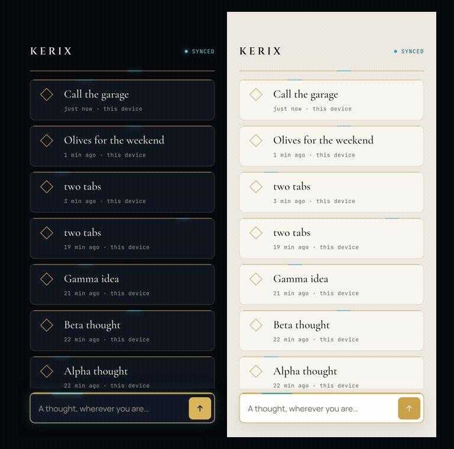

# Kerix

**Capture a thought anywhere. Dispatch it to a machine that does the work.**

Kerix is a herald. Open it on your phone or laptop, write a thought in two seconds, and it is on every device you own, even if you were offline when you wrote it. Later, a thought can be dispatched to a connected machine that starts working on it: a GitHub Actions runner, a server, or the laptop at home.

Built in public by [Leo Xeno](https://github.com/leoxeno). Zero running cost by design.

## Status

Version 0.2. Capture works and persists on each device, and signed-in devices now exchange thoughts through a relay in the background. Follow the build order in [docs/PRODUCT.md](docs/PRODUCT.md); the pick-up page is [docs/STATUS.md](docs/STATUS.md).

| Milestone | What | State |
|---|---|---|
| 1 | Quick capture inbox, local-first | done |
| 2 | Sync across devices | working, last hand checks pending |
| 3 | Done / archive | planned |
| 4 | Tags | planned |
| 5 | Search | planned |
| 6 | Dispatch to a machine | vision |
| 7 | On-device AI over your own thoughts | vision |

## Sync, as it runs today



Two phone-sized browsers signed in as the same person, recorded on 6 October 2026 against the development build. Each thought is written to the left device's own database first and shown at once; the sync engine then pushes it to the relay, the relay notifies the right device, and the right device pulls it, in about a second end to end. Airplane mode changes nothing on the device that is typing: the thought waits in an outbox and leaves when the connection returns. Not finished yet: the device label on pulled rows, deployment, and the self-updating install. Spec: [docs/specs/002-sync.md](docs/specs/002-sync.md).

## How it is built

- **One codebase, installable everywhere.** A progressive web app. Add to home screen on iPhone and Android, install on desktop. No app stores.
- **Local-first.** Every write lands in the device's own database first (IndexedDB via Dexie). The UI never waits on a network for your own thought. Sync is a background concern.
- **TypeScript, React 19, Vite 8, Tailwind 4.** The most documented stack there is, so anyone can read it.
- **Tested with Vitest**, linted with oxlint, every push verified by GitHub Actions.

## The look

Two modes from one set of tokens. Light is *Isu Marble*: warm stone, hairline gold seams, a cyan glint. Dark is *Nexus*: obsidian, gold filigree, cyan glow. The design decisions, every alternative considered, and the mockup sources are in [docs/design](docs/design).

## How it is built, the method

Spec-driven. The repository is the source of truth, not any chat. Agent rules live in [CLAUDE.md](CLAUDE.md) (mirrored as `AGENTS.md`), which links to the vision, architecture, data model, conventions, ADRs and numbered feature specs under [docs/](docs/). Every feature starts as a spec with acceptance criteria, then tests, then code. One script, `scripts/check.sh`, defines green for hooks and CI alike.

## Run it

```bash
npm install
./scripts/setup-dev.sh   # once: git hooks
cp .env.example .env.local   # optional: fill in a Supabase project to turn sync on; without it the app is local only
npm run dev        # on your LAN too, so you can open it on your phone
npm test
npm run build
./scripts/check.sh # the full gate
```

## Name

*Kerix*, from the Greek κῆρυξ, the herald: the one who carries the command out of the citadel. The naming rounds are in [docs/design/NAMES.md](docs/design/NAMES.md).

## License

All rights reserved. The code is published so the build can be followed in public, not as a grant of rights. See [LICENSE](LICENSE). If you want to use any of it, open an issue and ask.
